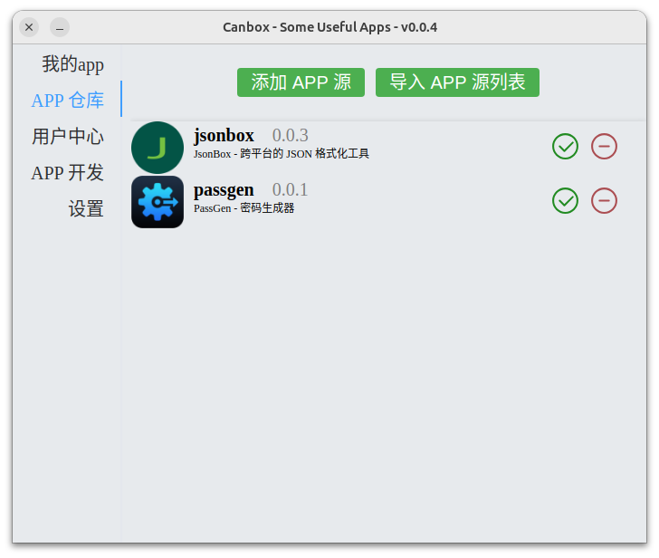
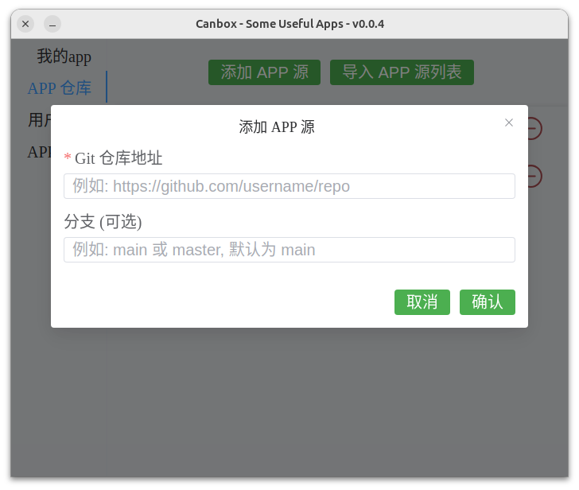
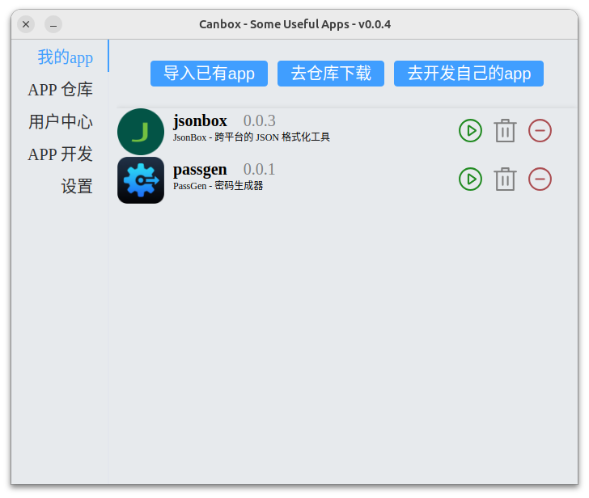

# Canbox

**Canbox** 是一个集合了多种实用工具的应用平台，旨在为大家提供一个便捷的使用各种小工具的途径。

**Canbox** 是一个app集合平台，在这里我们可以开发自己的小工具，并且分享给他人使用。

**Canbox** 没有服务器，可以：

1. 通过github、gitee等进行app分享

   
2. 导入app开发者打包好的程序包

   

# 功能特性

- **应用管理**：支持应用的安装、卸载和更新。
- **快捷方式**：为常用应用创建快捷方式。
- **多系统支持**：基于Electron，支持linux、windows（未测试完全）、mac（我没有mac😢，这个等有mac的人来干😆）

# APP

在“APP仓库”-“添加APP源”里填入下面的Repo URL，即可添加APP源。

| App     | Repo URL                               | Description              |
| ------- | -------------------------------------- | ------------------------ |
| JsonBox | https://gitee.com/lizl6/cb-jsonbox     | JSON格式、转换           |
| passgen | https://github.com/rexlevin/cb-passgen | 生成密码、随机串、时间戳 |

# 下载

[GitHub Release](https://github.com/rexlevin/canbox/releases)

# 欢迎提交 Issue！

# 开发文档

[Canbox 开发文档](./docs/CANBOX_DEV_CN.md)

[APP 开发文档](./docs/APP_DEV_CN.md)

[API 文档](./docs/API.md)

# 许可证

Apache 2.0
