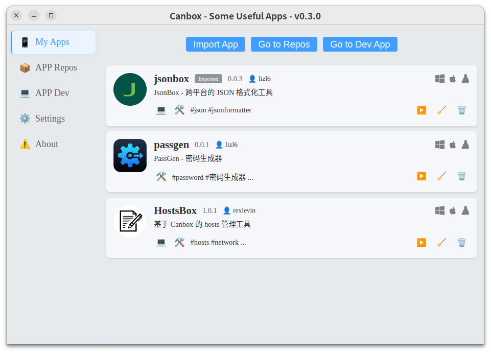
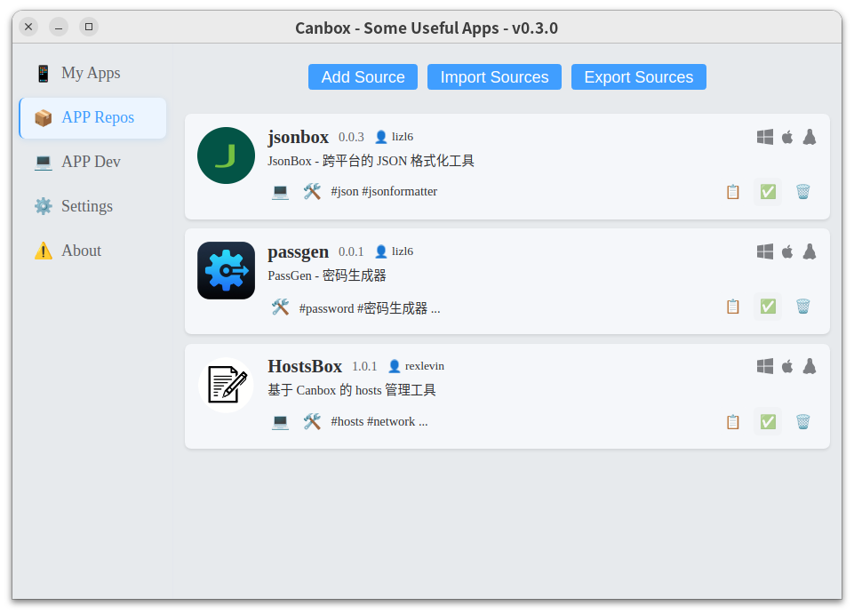
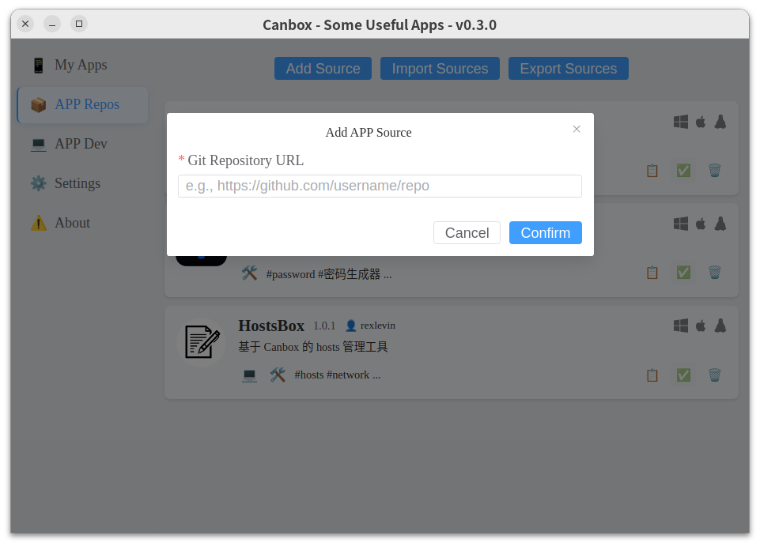
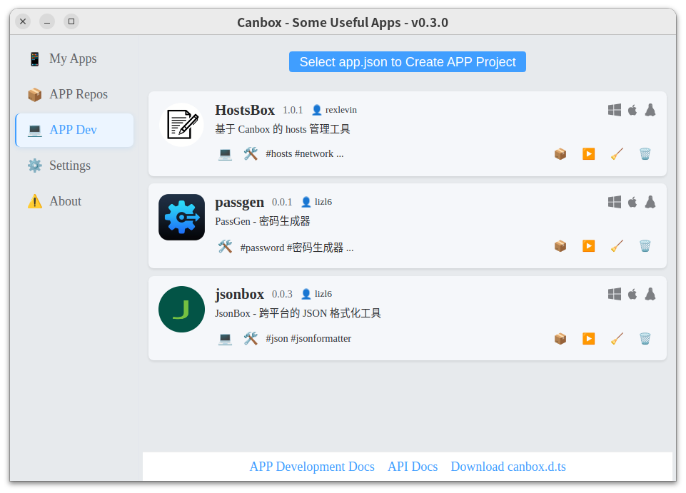
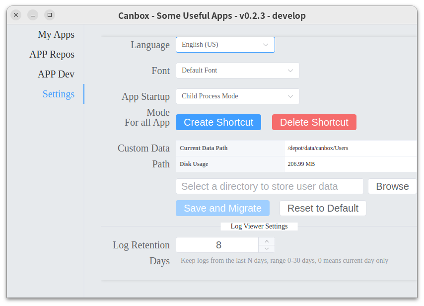
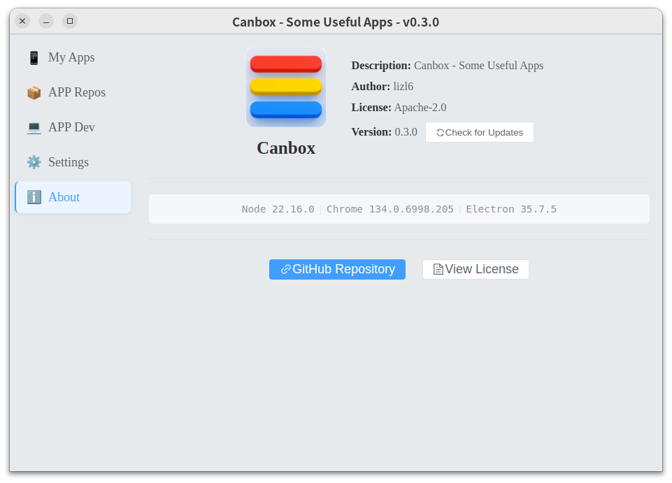

# Canbox

[中文版](README_zh-CN.md) | [English](README.md)


**Canbox** is a lightweight application runtime platform that provides minimal core capabilities, allowing developers to focus on implementing their own application logic.

**Canbox** is an app collection platform where we can develop our own small tools and share them with others.

**Canbox** has no server and can:

1. Share apps through GitHub, Gitee, etc.
2. Import application packages packaged by developers
3. Develop your own apps and package them for sharing with others

---

## 🚧 Project Status

**Canbox is currently in early development stage, and many features are not yet mature or complete.**

As a self-taught developer without formal training, I've created the initial version of Canbox on my own. However, I recognize my technical limitations. Therefore, I warmly welcome and look forward to:

- ✅ Experienced developers submitting Pull Requests to improve the codebase
- ✅ Collaborating together to enhance features and fix bugs
- ✅ Sharing development experiences and best practices
- ✅ Providing constructive issues and suggestions

Canbox is an open project, and every contribution helps make it better!

---

## 🗺️ Planned Features

The following features are planned for future development. For detailed information, please see [Feature Roadmap](./docs/FEATURE_ROADMAP.md).

---

# Features

- **App Management**: Supports installation, uninstallation, and updates of applications.
- **Shortcuts**: Create shortcuts for frequently used applications.
- **Multi-platform Support**: Based on Electron, supports Linux, Windows (not fully tested), and macOS (I don't have a Mac 😢, waiting for someone with a Mac to do this 😆)
- **App Import**: Supports importing offline application packages, suitable for scenarios where apps cannot be publicly shared.
- **Log Viewer**: Built-in log viewer with real-time log monitoring, filtering, search, and export capabilities.

# Canbox Usage

## My Apps



### Import Existing Apps

Canbox supports importing application packages packaged by developers (ZIP format).

This feature is particularly suitable for scenarios where apps cannot be publicly shared, such as:

- Internal enterprise tools that should not be made public
- Apps containing sensitive business logic or proprietary algorithms
- Personal tools with private data processing requirements
- Temporary or experimental apps not ready for public release
- Customized apps for specific organizations or teams

### Import Steps

1. Click the "Import App" button on the "My Apps" page
2. Select the ZIP file provided by the developer
3. The system will automatically extract and install the application

**Import File Requirements**:

- File type: ZIP (.zip)
- Content: Contains asar files and necessary application files
- File naming: Recommended to use `{app-id}-{version}.zip` format

After importing, the app will appear in the "My Apps" list and can be used directly.

### Data Management

- **Clear App Data**: Clear runtime data for specific apps in "My Apps"
- **Data Storage Location**: App data is stored in the system user data directory

## App Repository





### Add App Source

Enter the Repo URL in "App Repository" -> "Add App Source" to add an app source.

| App     | Repo URL                               | Description                                           |
| ------- | -------------------------------------- | ----------------------------------------------------- |
| JsonBox | https://github.com/rexlevin/cb-jsonbox | JSON formatting, JSON to other formats like xml, yaml |
| PassGen | https://github.com/rexlevin/cb-passgen | Generate passwords, random strings, timestamps        |

For more apps, please visit: [Canbox App Center](https://rexlevin.github.io/canbox-pages/apps.html)

### Export App Source List

1. Click the "Export App Source List" button on the "App Repository" page
2. Choose the save location and filename (JSON format)
3. The exported file contains complete information for all current repositories

### Import App Source List

1. Click the "Import App Source List" button on the "App Repository" page
2. Select the previously exported JSON file
3. The system will automatically parse and add repositories

**Import File Format Requirements**:

- File type: JSON (.json)
- Format: Repository array
- Required fields: `repo` (repository URL)
- Other fields will be ignored

**Example File Content**:

```json
[
    {
        "repo": "https://github.com/user/repo1"
    },
    {
        "repo": "https://github.com/user/repo2"
    }
]
```

## App Development



Canbox acts as a lightweight runtime, providing a minimal set of core capabilities to give apps the freedom to implement their own business logic.

### Runtime Core Capabilities

Canbox provides the following core features for apps:

**Data Persistence**

- `canbox.db` - Local database based on PouchDB (put/get/bulkDocs/remove)
- `canbox.store` - Key-value storage based on electron-store

**System Interaction**

- `canbox.dialog` - Native file dialogs (open/save/message)
- `canbox.win.createWindow` - Create child windows
- `canbox.win.notification` - System notifications

**Lifecycle**

- `registerCloseCallback` - Window close callback

**Design Principles**

- Keep minimal, providing only core capabilities
- Other features are implemented by apps themselves (e.g., network requests, clipboard operations, etc.)
- Ensure apps have sufficient freedom

### Development Process

1. **Create Development Project**

   - Click "Select app.json to create new app project" on the "App Development" page
   - Select the directory containing the app.json configuration file
   - app.json must contain the following fields:
     - `id`: Unique app identifier
     - `name`: App name
     - `version`: App version
     - `description`: App description
     - `author`: Author information
     - `logo`: App icon path (relative to app.json)
2. **Debug App**

   - Click the run icon to test the app in the development environment
   - Can modify code and re-run at any time
   - Supports clearing app data for re-testing
3. **Package App**

   - Click the package icon to package the app as an asar file
   - Automatically generate a ZIP package for sharing
   - Package artifacts are located in the project's `dist` directory

### Package Configuration

Create a `cb.build.json` configuration file in the project root directory:

```json
{
  "outputDir": "dist",
  "files": [
    "app.json",
    "README.md",
    "HISTORY.md",
    "build/**/*",
    "src/**/*"
  ]
}
```

Configuration description:

- `outputDir`: Package output directory
- `files`: File patterns to package (supports glob syntax)

For detailed development guides, please refer to:

- [Canbox Development Documentation](./docs/development/CANBOX_DEV.md)
- [App Development Documentation](./docs/development/APP_DEV.md)
- [API Documentation](./docs/development/API.md)

## Settings



Canbox provides rich settings options to help you personalize the application configuration.

### General Settings

- **Language**: Choose application language (Chinese, English)
- **Font**: Select application font (supports default and multiple system fonts)
- **App Execution Mode**: Choose between Window mode or Childprocess mode
- **Create/Delete Shortcut**: Create desktop shortcuts for Canbox

### Data Management

- **Custom Data Path**: Set a custom directory for all Canbox data
  - View current data path and disk usage
  - Migrate to a new path (requires restart)
  - Reset to default path (requires restart)

### Log Viewer Settings

- **Log Retention Days**: Configure how many days of log files to keep (0-30 days, default 30)
  - Set to 0 to disable automatic log cleanup
  - Old logs are cleaned up automatically when opening the log viewer

### Auto Update

- **Enable Auto Update**: Automatically check for new versions when the application starts
- **Check Frequency**: Choose how often to check for updates (on startup, daily, weekly, or manual)
- **Manual Check**: Click the "Check for Updates Now" button to manually trigger a version check
- **Skipped Versions**: View and clear versions that were previously skipped

### Log Viewer

Access the log viewer from the system tray menu or use keyboard shortcuts. Features include:

- **Real-time Monitoring**: View logs in real-time with auto-scroll
- **Log Filtering**: Filter by log level (debug, info, warn, error)
- **Search**: Search logs with keyword matching or regex
- **Export**: Export logs in .txt or .json format
- **Date Navigation**: View historical logs by date
- **Log Management**: Clear current logs or clean up old log files
- **Multiple Sources**: Switch between application logs and monitor logs
- **Always on Top**: Keep the log viewer window on top

### Shortcuts

Canbox supports creating shortcuts for frequently used applications:

- Desktop shortcuts (Windows, Linux)
- Start menu shortcuts (Windows)
- Application menu shortcuts (macOS)

Shortcuts automatically sync with the application. When an app is deleted, corresponding shortcuts are automatically cleaned up.

## About



View Canbox version information, official links, and open-source acknowledgments.

- **Version Info**: Current Canbox version number
- **Official Links**: GitHub repository, official website
- **License**: Apache 2.0 open source license
- **Acknowledgments**: Thanks to all open source projects and contributors

# Installation

## Download

Canbox provides the following formats for download and installation:

- **Linux**: AppImage format (recommended) - Compatible with most Linux distributions
- **Windows**: Installer package
- **macOS**: Coming soon

Please visit the project's GitHub Releases page to download the latest version of Canbox.

# Issues Welcome!

# Development Documentation

[Canbox Development Documentation](./docs/development/CANBOX_DEV.md)

[App Development Documentation](./docs/development/APP_DEV.md)

[API Documentation](./docs/development/API.md)

# License

Apache 2.0
